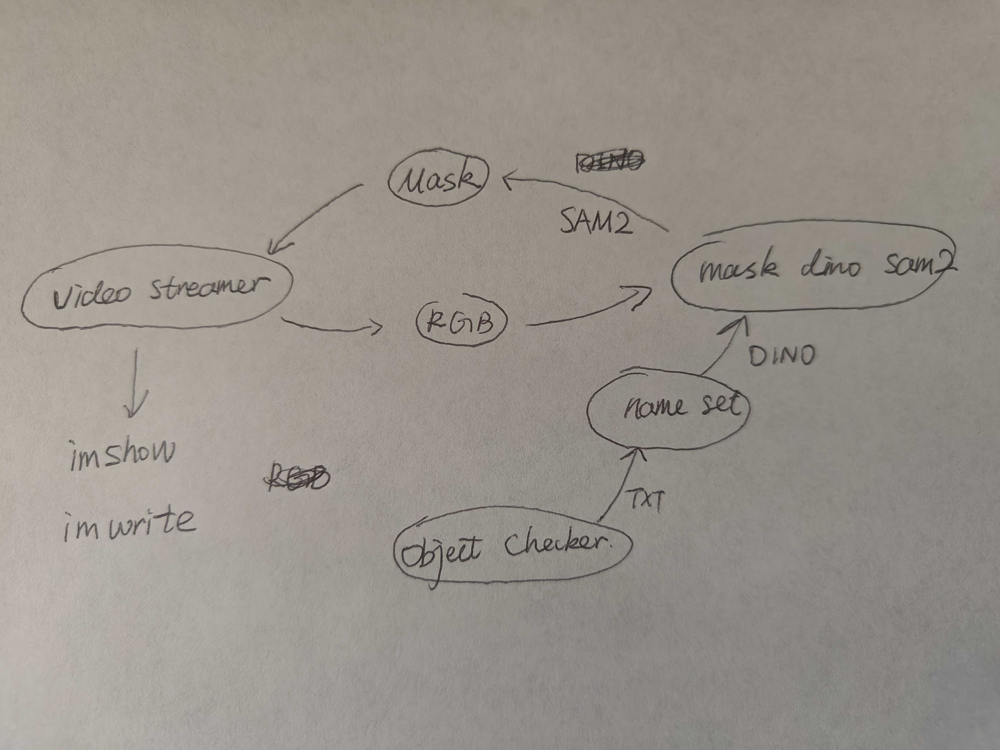
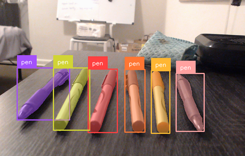
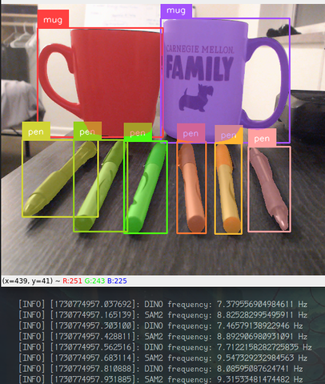

# Install streaming grounded sam2 enviroment
```shell
conda create --name dino_sam2 python=3.11

conda activate dino_sam2

# this adds the conda-forge channel to the new created environment configuration 
conda config --env --add channels conda-forge
# and the robostack channel
conda config --env --add channels robostack-staging
# remove the defaults channel just in case, this might return an error if it is not in the list which is ok
conda config --env --remove channels defaults

# Install ros-noetic into the environment (ROS1)
mamba install ros-noetic-desktop

conda deactivate
conda activate dino_sam2

mamba install compilers cmake pkg-config make ninja colcon-common-extensions catkin_tools rosdep

pip install --pre torch torchvision torchaudio --index-url https://download.pytorch.org/whl/nightly/cu124

pip install -e grounding_dino

pip install -e .

pip install git+https://github.com/huggingface/transformers


# install bytetracker
cd byte_track
pip install -e .

git clone git@github.com:valentin-fngr/cython_bbox.git
cd cython_bbox
## before installing, change the source code first
# in cython_bbox repo, in file src/cython_bbox.pyx change lines 12 and 13 to be:
# DTYPE = np.float32
# ctypedef np.float32_t DTYPE_t
pip install -e .


```

## Oct. 10


# Oct. 17



# Nov. 5

- DINO + SAM2 Video Stream Tracking $\rightarrow$ DINO + SAM2 Image-based Segmentation

    - Image-based SAM2 relates to number of selected objects, but not too much
    - The upper limit depends on DINO

- Test the new pipeline with real env data.
- SAM2 has prediction_batch.

2 Mug tracking:
[INFO] [1730774478.126161]: DINO frequency: 7.972143226919332 Hz
[INFO] [1730774478.241277]: SAM2 frequency: 10.107925760034648 Hz
6 Pen tracking:
[INFO] [1730774661.782984]: DINO frequency: 7.855825861604983 Hz
[INFO] [1730774661.900735]: SAM2 frequency: 9.637204172284916 Hz





TODO:
- [ ] Video Stream Delay.